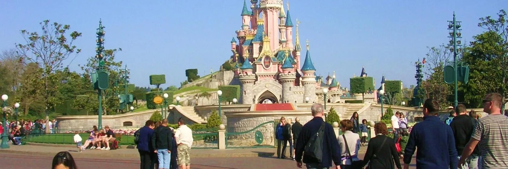

<h1><a href="https://en.paris-car-service.com/book/paris-roissy-charles-de-gaulle-airport-cdg-1/disneyland-paris-park-eurodisney-2/">Getting to Disneyland Paris from CDG Airport</a></h1> 
   
Embark on a magical adventure to Disneyland Paris! To ensure a smooth start to your vacation, let's explore the best ways to get from Charles de Gaulle Airport (CDG) to the park.

    <h2>1. Private Transfer: Your Royal Carriage</h2>
    
Imagine arriving at CDG Airport and being greeted by your own personal chauffeur. A private transfer offers the ultimate in comfort and convenience. Your driver will whisk you away from the airport directly to your Disney hotel, bypassing the crowds and the stress of public transportation.

    <h3>Why Choose a Private Transfer?</h3>
    <ul>
        <li>Personalized Service: Your driver will cater to your family's needs, ensuring a stress-free journey.</li>
        <li>Flexibility: Customize your itinerary and make stops along the way, such as a charming French village or a picturesque vineyard.</li>
        <li>Comfort: Relax in a luxurious vehicle and enjoy the scenic views.</li>
        <li>No Hassle: Avoid the stress of public transportation and the hassle of navigating unfamiliar routes.</li>
        <li>Direct to Your Hotel: Your driver will take you directly to the entrance of your Disney hotel, saving you time and energy.</li>
    </ul>
    
Book your private transfer today and experience the magic of Disneyland Paris from the moment you step off the plane.

    <h2>2. Magical Shuttle: Your Enchanted Bus Ride</h2>
    
Hop on the Magical Shuttle, a direct bus service that takes you straight to your Disney hotel. This is a convenient and affordable option for families traveling on a budget.

    <h3>Why Choose the Magical Shuttle?</h3>
    <ul>
        <li>Affordability: A budget-friendly way to reach Disneyland Paris.</li>
        <li>Convenience: Direct service to your Disney hotel.</li>
        <li>Fun Atmosphere: Enjoy the festive atmosphere and meet other Disney fans.</li>
    </ul>
    <h2>3. Train Travel: Your Express to Magic</h2>
    
For a truly magical experience, take the high-speed train from CDG Airport to Marne-la-Vallée-Chessy station. This is a fast and efficient way to travel, with stunning views of the French countryside along the way.

    <h3>Why Choose Train Travel?</h3>
    <ul>
        <li>Speed and Efficiency: Reach Disneyland Paris quickly and efficiently.</li>
        <li>Scenic Views: Enjoy the beautiful French countryside.</li>
        <li>Eco-Friendly: A sustainable transportation option.</li>
    </ul>
    <h2>Tips for a Smooth Journey</h2>
    <ul>
        <li>Book in Advance: Reserve your transportation in advance, especially during peak seasons.</li>
        <li>Pack Light: Pack efficiently to avoid unnecessary luggage.</li>
        <li>Plan for Delays: Be prepared for potential delays and traffic.</li>
        <li>Stay Hydrated and Energized: Keep your family hydrated and fed to ensure a pleasant journey.</li>
        <li>Check the Weather: Check the weather forecast before your trip to pack accordingly.</li>
        <li>Bring Snacks and Water: Keep your family hydrated and fed during the journey.</li>
        <li>Entertainment: Bring books, games, or tablets to keep children entertained during the journey.</li>
        <li>Comfort: Wear comfortable clothing and shoes.</li>
        <li>Arrive Early: Arrive at the airport early to allow plenty of time for check-in and security.</li>
        <li>Use a Luggage Trolley: A luggage trolley can make it easier to transport your luggage through the airport.</li>
        <li>Check-in Online: Check in online to save time at the airport.</li>
        <li>Use a Mobile Boarding Pass: A mobile boarding pass can help you avoid lines at the airport.</li>
        <li>Pack Light: Pack only the essentials to avoid lugging heavy bags around.</li>
        <li>Stay Organized: Keep important documents, such as passports and tickets, in a safe place.</li>
        <li>Relax and Enjoy: Remember to relax and enjoy the journey.</li>
    </ul>
    
With a little planning, you can make your journey to Disneyland Paris as stress-free and enjoyable as possible.

    
By following these tips and doing a little research, you can ensure that your family has a magical experience from start to finish.

  
